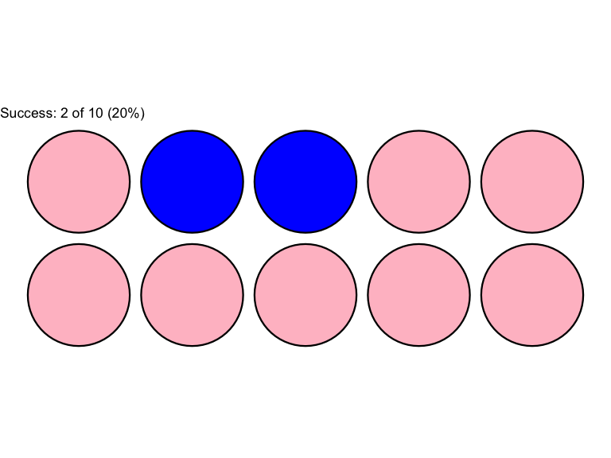
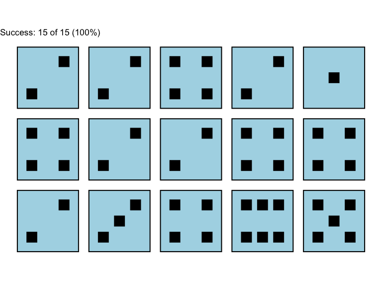

## Lecture Outline

* Recap of data and statistical tools
* Descriptive statistics: Central tendency, variability
* Computation
        


## Statistics and data

- Statistics is all about data (recently rebranded as **Data Science**).
- Modern technology records data every moment everywhere, including cellphones, satellites, health records, traffic cameras, etc.
- *Our job?* Analyze, model, prediction, uncertainty, (and more).


## Statistics and data (contd.)

- _Examples_: 
  1. Toss a coin $1000$ times.
  2. Temperature over the U.S. land region.
  3. Blood pressure of patients over time.
  4. Driving pattern.
  

## Some terminologies: Variables and Realizations
  
* A **(random) variable** is a quantity or object that takes on different values based on the outcome of a phenomenon or experiment.
* A **realization** of a random variable is the actual outcome of the random variable after an experiment is conducted. 


## Examples of Variable and Realizations


| Random Variable Example                  | Possible Realizations    |
|------------------------------------------|--------------------------|
| Outcome of a die roll                    | 1, 2, 3, 4, 5, 6         |
| Outcome of a coin flip                   | Head, tail               |
| Number of cars taking Exit 12 | Any integer $\geq$ 0|
| Score of a student on a test             | Integer between 0 - 100  |
| Blood type of a randomly selected person | A, B, AB, O, others      |


## Notations

* Variables denoted by capital letters (e.g., $X$, $Y$, $Z$).
* Realizations denoted with small letters ($x$, $y$, $z$).
* Example: Supposed I tossed a coin $10$ times and I got T (Tail), H (Head), H, T, T, T, H, T, H, T. 
  1. Here, random variable: X = Outcome of a coin toss.
  2. Realizations: $x_1$ = T, $x_2$ = T, $x_3$ = H, $x_4$ = H, $\cdots$, $x_{10}$ = T.


## Experiment 1:  Toss a Coin

* Possible realizations: Head(in pink), Tail(in blue).
* Following $\texttt{R}$ code tosses a coin $10$ times:

``` r
# Use install.packages(magrittr) and install.packages(tidydice) once
library(magrittr) 
library(tidydice)
flip_coin(times = 5, rounds = 2) %>%  plot_coin(fill = "pink", fill_success = "blue")
```



## (Just for fun) $\texttt{R}$ Implementation 2

* Following $\texttt{R}$ code rolls a die $15$ times:


``` r
out = roll_dice(times = 5, rounds = 3, success = 1:6)
plot_dice(out, fill = "lightblue", fill_success = "lightblue")
```




## Analyzing Data -- *Central Tendency* and *Divergence*

* Statisticians use many different measures to analyze the data patterns, such as
   1. Overall behavior of the data.
   2. Variability in the data. 
   3. Data visualization.
   

## Analyzing Data (contd.)
* *Overall behavior* is analyzed with *central tendency* measures.
* *Variability* from central tendency is analyzed with *divergence* measures.
* Note: Analysis can be as complex as the data warrants. We will only focus on the simple things in this class.


## Central Tendency measures: Mean

- Suppose that I have $n$ realizations $x_1, \cdots, x_n$ from a random variable $X$.

- Arithmetic mean is defined as:

$$ \bar{x} = \frac{x_1 + x_2 + ... + x_n}{n} $$


## Example:

- I tossed a die 10 times and I got
<center> 4, 3, 6, 1, 6, 5, 5, 4, 3, 1 </center>
  - Variable: X = Rolling a die.
  - Number of realizations: n = 10.
  - Realizations: $x_1 = 4, x_2 = 3, \cdots, x_{10} = 1.$
  - Mean: $$ \bar{x} = \frac{4 + 3 + 6 + 1 + 6 + 5 + 5 + 4 + 3 + 1}{10} = \frac{38}{10} = 3.8 $$
  

## Why important?

  - Most commonly used measure to express central tendency.
  - Gives an idea on overall (or average) trend.
  - $\texttt{R}$ syntax:


``` r
mean(<<vector_name>>) # if your variable is not part of a dataset
mean(<<dataset_name>>$<<variable_name>>) 
# if your variable is part of a dataset
```

## Mean (Contd.)

- **Example 1**:  The following data represent the life Span for a Species of Birds in Captivity: $39, 50, 82, 37, 42, 40, 41, 16, 32$.


``` r
lifespan = c(39, 50, 82, 37, 42, 40, 41, 16, 32)
mean(lifespan) # This is the mean
```

```
## [1] 42.11111
```

``` r
sum(lifespan)/9 # Check that mean == sum/count 
```

```
## [1] 42.11111
```


## Mean (Contd.) Example 2 
- Let's do this example in class.
- **Example 2**:  The following data is a sample of 12 butterfly wing lengths (in centimeters): $4.3, 4.4, 4.0, 4.5,  3.8, 3.9, 4.1,  3.6, 3.7, 3.3, 3.5, 4.2$
- What is the mean wing length of this sample?


## Central Tendency: Median

- Definition: median

    - The value that is the middle measurement in an ordered set of data.
    
        - If *n* is odd, then the median is literally the middle number (or the $\frac{n+1}{2}$-th number) of the ORDERED set.
    
        - If *n* is even, then the median is the mean of the two middle numbers (or the mean of $\frac{n}{2}$-th and (1+$\frac{n}{2}$) number) from the ordered set.
    
    
## Median: $\texttt{R}$ syntax


``` r
median(vector) # if your variable is not part of a dataset
median(dataset$variable) # if your variable is part of a dataset
```

## Median (Contd.): Example 1

Recall the previous examples.

1.  **Example 1**:  The following data represent the life Span for a Species of Birds in Captivity: $39, 50, 82, 37, 42, 40, 41, 16, 32$.


``` r
lifespan <- c(39, 50, 82, 37, 42, 40, 41, 16, 32)
median(lifespan) # This is the median
```

```
## [1] 40
```

## Verify the answer
  
  - **Step 1**: Order the data ascending/descending.
<center> 16, 32, 37, 39, 40, 41, 42, 50, 82. </center>

  - **Step 2**: Count the number of observations.
 Here we have $n = 9$ observations.

  - **Step 3** If $n$ is odd, median is the middle number, i.e., $\frac{n+1}{2}$ =  $\frac{9+1}{2}$ = $5^{th}$ number.

- So, the median is in  <font color="#db0b9d">red</font> : <center>16, 32, 37, 39, <font color="#db0b9d">40</font>, 41, 42, 50, 82.</center>


## Median (Contd.): Example 2

- Let's do this example in class.
- **Example 2**:  The following data is a sample of 12 butterfly wing lengths (in centimeters): $4.3, 4.4, 4.0, 4.5,  3.8, 3.9, 4.1,  3.6, 3.7, 3.3, 3.5, 4.2$


## Verify the answer
  
  - **Step 1**: Order the data ascending/descending.
<center> 3.3, 3.5, 3.6, 3.7, 3.8, 3.9, 4.0, 4.1, 4.2, 4.3, 4.4, 4.5 </center>

  - **Step 2**: Count the number of observations.
 Here we have $n = 12$ observations.
 

## Verify the answer

  - **Step 3** If $n$ is even, median is the mean of the two middle numbers, which are the $\frac{12}{2} = 6^{th}$ and $(1 + \frac{12}{2}) = 7^{th}$ numbers.

- So, the median is the mean of the <font color="#db0b9d"> red </font> numbers: <center>3.3, 3.5, 3.6, 3.7, 3.8, <font color="#db0b9d"> 3.9, 4.0, </font> 4.1, 4.2, 4.3, 4.4, 4.5 </center>, i.e., $\frac{3.9 + 4.0}{2}$ = $3.95$.


## Divergence measures: Variance and Standard Deviation


* Mean and median are two statistics to measure the overall behavior of data.
* However, we want to know how *sparse* the data is, i.e., how much it diverges from the central tendency.
* Two common measurement of divergence are *variance* and *standard deviation*.

## Variance

* Definition: variance

$$s^2 = \sum_{i=1}^n  \frac{(x_i - \bar{x})^2}{n-1} = \frac{\sum_{i=1}^n x_i^2 - \frac{(\sum_{i=1}^n x_i)^2}{n}}{n-1}$$

* Definition:  Standard Deviation

$$s = \sqrt{s^2}$$

## $\texttt{R}$ implementation

- $\texttt{R}$ syntax:


``` r
var(vector) or sd(vector) # if your variable is not part of a dataset
var(dataset$variable) or sd(dataset$variable) # if your variable is part of a dataset
```


## Variance from Example 1

- This is the previous lifespan example.


``` r
lifespan <- c(39, 50, 82, 37, 42, 40, 41, 16, 32)
var(lifespan) #This is the variance
```

```
## [1] 309.8611
```

``` r
sd(lifespan) #This is the standard deviation
```

```
## [1] 17.60287
```


## Variance from Example 2

- This is the previous wing length example.
- Let's do this example in class.


## Why study divergence?


- Suppose both the Biostatistics sections have average grade **B**, but
  - Everybody in section 1 got **B**.
  - 50% in section 2 got **A**, other 50% in section 2 got **B**.
  
- Here mean is same for both sections, but we must study divergence/ variance to understand the differences in two sections.


