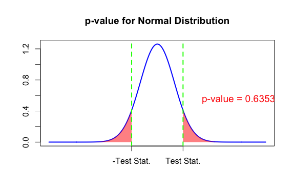

\newcommand{\X}{\mathrm{X}}


## Lecture Outline

* Normal distribution
* Estimation
* Confidence interval
* Hypothesis testing
* p-value

# Normal Distribution

## Binomial Distribution

* Recall the coin toss example from last class. We tossed a coin $n$ times, where one toss followed a *probability distribution* as:
  \begin{align*}
  \mathbb{P}(X = H) = p \\
  \mathbb{P}(X = T) = 1-p \\
  \end{align*}

* This is an example of Binomial distribution.
* Very important for discrete or non-numeric data.
* To be revisited later, while analyzing count data.


## Plotting the Probability Distribution

* If I assign $p = 0.2$, the plot of probabilities will look like this:


## Plotting the Probability Distribution

* If I assign $p = 0.5$, the plot of probabilities will look like this:


## Normal Distribution

* Normal or Gaussian distribution is another probability distribution -- but for continuous data.
* The most common choice to analyze continuous data.
* We will discuss estimation, confidence interval, and hypothesis testing.
* Computation


## Normal Distribution: Definition

* Defined by two parameters: $\mu$ (mean) and $\sigma^2$ (variance).
* We write: $X \sim N(\mu, \sigma^2)$.
* Probability density function:
  $$f(x; \mu, \sigma^2) = \frac{1}{\sqrt{2\pi \sigma^2}} \exp{ - \frac{(x - \mu)^2}{2\sigma^2}}$$
* *Standard* normal distribution: When $\mu$ = 0, $\sigma^2$ = 1.
  

## Plotting the Probability Distribution


## Properties


* Mean($X$) or $\mathbb{E}(X)$ = $\mu$.
* Median($X$) = $\mu$.
* Variance($X$) or var($X$) = $\sigma^2$.
* $X$ is symmetric around the mean.
* Quartiles:
  - $Q_1 \approx \mu − 0.674 * \sigma$
  - $Q_3 \approx \mu + 0.674 * \sigma$
  - $Q_2 = ??$
  - IQR = ??
 

## Properties


* Mean($X$) or $\mathbb{E}(X)$ = $\mu$.
* Median($X$) = $\mu$.
* Variance($X$) or var($X$) = $\sigma^2$.
* $X$ is symmetric around the mean.
* Quartiles:
  - $Q_1 \approx \mu − 0.674 * \sigma$
  - $Q_3 \approx \mu + 0.674 * \sigma$
  - $Q_2$ = <span style="color:blue;"> $\mu$ </span>
  -  IQR  $\approx$ <span style="color:blue;"> $1.35 \sigma$ </span>
  


## Question

* What is the meaning of $Q_1$ here?


## Question

* What is the meaning of $Q_1$ here?
- <span style="color:blue;"> Probability of getting data $\leq Q_1$ = $\frac{1}{4}$.</span>


## Using Normal Distribution


* To use normal distribution in data analysis, we assume that <span style="color:blue;">our data is a sample from a population that follows a normal distribution. </span>
* Recall, we almost always have a sample data, never the entire population.
* Recall, we never know parameters. Can only guess them from sample statistics.
* Use data to estimate the parameters $\mu$ and $\sigma^2$.
* <span style="color:red;"> Careful, nothing in real life exactly follows a statistical model.</span>

# Estimation


## Point Estimates

* A single value of a statistic, calculated  from our sample data,  that serves as the best guess of an unknown parameter.

* Example: 
  - Sample mean is an estimator of population mean.
  - Sample variance is an estimator of population mean.
  - You may try to research about BLUP (best linear unbiased predictors).
  

## Normal Distribution Estimates

* Suppose we have a continuous random variable $\X$; and we have  realizations $\{x_1, \ldots, x_n\}$ from it.
* We assume it to be a sample from a $\mathbb{N}(\mu, \sigma^2)$ (or $X \sim N(\mu, \sigma^2)$).
* Estimate the parameters $\mu$ and  $\sigma^2)$ with their sample equivalents:
  - $\hat{\mu} = \bar{x}$ (sample mean).
  - $\hat{\sigma^2} = s^2$ (sample variance).
  


## Example

* Question: Assume that from the $\texttt{mtcars}$ data, the gas mileage variable is a sample from a normal distribution. What is your best estimate for it's mean and variance?


## Example (contd.)

* Question 1: Assume that from the $\texttt{mtcars}$ data, the gas mileage variable is a sample from a normal distribution. What is your best estimate for it's mean and variance?


``` r
data("mtcars")
MPG = mtcars$mpg
mean(MPG)
```

```
## [1] 20.09062
```

``` r
var(MPG)
```

```
## [1] 36.3241
```


## Example (contd.)

Question 1: Assume that from the $\texttt{mtcars}$ data, the gas mileage variable is a sample from a normal distribution. What is your best estimate for it's mean and variance?

* I Assume that mpg $\sim N(\mu, \sigma^2)$. 
* From data, the sample mean is $\bar{x} = 20.09$, $s^2 =36.32$.
* So, my estimates are:
  - $\hat{\mu} = 20.09, \hat{\sigma}^2 = 36.32$.


## Example (contd.)

* Question 2: Under the same assumption and same data, what is the estimated population median?


## Example (contd.)

* Question 2: Under the same assumption and same data, what is the estimated population median?

  - Since normal mean and median are the same, it is still $\bar{x} =  \hat{\mu} = 20.09$.


# Confidence Interval

## Confidence Interval (CI)

* Even if we only have a sample of $3$ observations, we can always estimate both $\mu$ and $\sigma^2$.
* Recall the coin toss exmple. Is 6 H out of 10 decisive to suspect cheating?
Is 6348 H out of 10000 decisive enough?
* But, are they any good? How confident are we?
* To analyze the reliability of the estimate, we use confidence interval.


## CI (contd.)

* A $100(1 - \alpha)\%$ CI is an interval that is expected to contain the true parameter $100(1 - \alpha)\%$ time had we have access to a large number of samples.

* Example: Set $\alpha = 0.05$. A $95\%$ CI for the population mean  ($\mu$) means that, if we had 100 random samples from the population, I expect $95$ of the intervals to contain the true $\mu$.


## CI: Graphical View

<!-- -->


## Interval Width

* Wider interval are more likely to contain the parameter, thereby increases our confidence level $100(1 - \alpha)\%$.
* But, wider interval also introduces more uncertainty on my point estimate.
* Therefore, we want an interval as narrow as possible.
* We fix the confidence level first, typically at $95\%$ (or $\alpha = 0.05$), $90\%$, $99\%$. Then we try to narrow down the interval.


## CI for Normal Distribution

* <span style="color:blue;">Case 1: Known variance ($\sigma^2$)</span>.
  - Point estimate of $\mu$: $\bar{x}$.
  - $100(1-\alpha)\%$ of $\mu$ = $\bar{x} \pm z_{\alpha/2} * \frac{\sigma}{\sqrt{n}}$.
    - $\bar{x}$ is the sample mean.
    - $\sigma$ is the standard deviation.
    - $n$ is the number of observations.
    - $z_{\alpha/2}$ is the **z score**, a critical value. Same as the negative of $\frac{\alpha}{2}$-th quantile of a *standard* normal distribution.
    
    

## CI for Normal Distribution

* <span style="color:blue;">Case 2: Unknown variance (typical case).</span>
- Point estimate of $\mu$: $\bar{x}$.
- Point estimate of $\sigma^2$: $s^2$.
  - $100(1-\alpha)\%$ of $\mu$ = $\bar{x} \pm t_{\alpha/2, n-1} * \frac{s}{\sqrt{n}}$.
    - $\bar{x}$ and $s^2$ are the sample mean and variance.
    - $n$ is the number of observations.
    - $t_{\alpha/2, n-1}$ is the **critical value**, same as the negative of $\alpha/2$-th quantile from a **student's t** distribution with degrees of freedom $n-1$.


## $\texttt{R}$  syntax (Unknown  Variance)

``` r
t.test(vector, conf.level = 1- alpha)$conf.int
```

* Continue the last example with $\texttt{mtcars}$ data: $95\%$ CI for gas mileage (mpg).


``` r
data("mtcars")
mpgs = mtcars$mpg
t.test(mpgs, conf.level = 0.95)$conf.int
```

```
## [1] 17.91768 22.26357
## attr(,"conf.level")
## [1] 0.95
```

* My $95\%$ confidence interval for $\mu$, the unknown population mean of mpg is $(17.92, 22.26)$.


## $\texttt{R}$ Example

* Let's find the $90\%$ CI for mpg (or $\alpha$ = 0.1).


``` r
data("mtcars")
mpgs = mtcars$mpg
t.test(mpgs, conf.level = 0.90)$conf.int
```

```
## [1] 18.28418 21.89707
## attr(,"conf.level")
## [1] 0.9
```

* My $95\%$ confidence interval for $\mu$, the unknown population mean of mpg is $(18.28, 21.90)$.

* Note, smaller interval compared to the earlier.


## $\texttt{R}$ Example (contd.)

* Let's find the $99\%$ CI for mpg (or $\alpha$ = 0.01).


``` r
data("mtcars")
mpgs = mtcars$mpg
t.test(mpgs, conf.level = 0.99)$conf.int
```

```
## [1] 17.16706 23.01419
## attr(,"conf.level")
## [1] 0.99
```

* My $99\%$ confidence interval for $\mu$, the unknown population mean of mpg is $(17.17, 23.01)$.

* Note, much wider interval compared to the earlier.

## Question

* Can I calculate this interval manually in $\texttt{R}$?
* You need to know two commands:
  -   $\texttt{qt(<quantile>, <df>)}$: to generate the critical value for $t$-distribution with degrees of freedom $df$.
  -   $\texttt{qnorm(<quantile>)}$: to generate the critical value for standard normal distribution.


## Example: Manual computation of CI (unknown case)

Example with $\texttt{mtcars}$ data: $95\%$ CI for gas mileage (mpg).


``` r
data("mtcars")
n = nrow(mtcars)
mpgs = mtcars$mpg
xbar = mean(mpgs)
sample_sd = sd(mpgs)
alpha = 0.05
critical_score = qt(1 - alpha/2, df = n - 1)
lower = xbar -critical_score * sample_sd/sqrt(n)
upper = xbar +critical_score * sample_sd/sqrt(n)
c(lower, upper)
```

```
## [1] 17.91768 22.26357
```


## Example: Manual computation (known case)

Example with $\texttt{mtcars}$ data: $95\%$ CI for gas mileage (mpg). Assume $\sigma = 6$.


``` r
sigma = 6
data("mtcars")
n = nrow(mtcars)
mpgs = mtcars$mpg
xbar = mean(mpgs)
alpha = 0.05
zscore = qnorm(1 - alpha)
lower = xbar -zscore * sigma/n
upper = xbar +zscore * sigma/n
c(lower, upper)
```

```
## [1] 19.78221 20.39904
```


# Hypothesis Testing

## Hypothesis Testing : Motivation

* Recall our coin toss example. 

  - 6 H out of 10 tosses: We should not be able to conclude cheating.
  - 6348 H out of 10000 tosses: We should be able to conclude cheating.
  
* Hypothesis testing helps quantify such decision making.


## CI vs Testing

* Take the coin toss example. 
* A confidence interval will generate an interval ($p_1, p_2$), from my estimated $\hat{p}$. I expect the CI to contain the true $p$ $95\%$ of the times if I could resample the data many times.

* In hypothesis testing, one would start with a starting belief (e.g., $p=0.5$). Then try to decide  if my belief is correct or not from the data.


## Definition


* A statistical method to draw conclusions or inferences about a population parameter based on sample data and statistics. 


## Hypotheses

* **Hypothesis**: A claim about the unknown population parameter.
  - Example: In the coin toss example, I suspect that probability of a Head (p) = 0.6
  - Careful: <span style="color:blue;">Hypothesis is about population parameters; never about the sample statistics.</span>

* We typically test two hypotheses: Null hypothesis ($H_0$) and Alternate hypothesis ($H_A$).

## Null vs Alternate

  - **Null hypothesis** ($H_0$): Starting claim or belief about the population parameter.
    - It is true until you have proof that it is false.
  - **Alternate hypothesis** ($H_A$): Another statement about the parameter. It is assumed to be true when we have evidence that $H_0$ is false.
    - We either reject $H_0$ (enough evidence that it's false) or we <span style = "color:limegreen">fail to reject</span> $H_0$. *We never accept $H_0$.*
  


## Graphical representation

<!-- -->


## One vs Two sided Test

* Depending on the **alternate hypothesis ($H_A$)**, a test can be one sided or two sided.

* If we want to test parameter = some value against parameter $\neq$ the value, the test is two sided.
  - e.g. Average score is 75 against not 75.
  - Your starting belief is not true if the sample average is too high or too low.

## One vs two tail Test
* If we want to test parameter = some value against parameter $\leq$ (or $\geq$) the value, the test is one sided.
  - e.g., Average score is 75 against $\leq$ 75. Your starting belief is not true if the sample average is too high .
  - , Average mileage is 75 against $\geq$ 75. Your starting belief is not true if the sample average is too low .
  


## Two-sided test

- $H_0$: $\mu$ = $m$, $H_A$: $\mu$ $\neq$ $m$.
- Evidence of false starting belief ($H_0$) is two sided: $\hat{\mu} \leq c_1$ or $\hat{\mu} \geq c_2$.


##  One-sided test: Case 1

- $H_0$: $\mu$ $\leq$ (or $=$) $m$, $H_A$: $\mu$ $\geq$ $m$.
- Evidence of false starting belief ($H_0$) is one sided: $\hat{\mu} \geq c$.


##  One-sided test: Case 2

- $H_0$: $\mu$ $\geq$ (or $=$) $m$, $H_A$: $\mu$ $\leq$ $m$.
- Evidence of false starting belief ($H_0$) is one sided: $\hat{\mu} \leq c$.


## Example 1

1. Recall the mallard duck weights example from last class. I want to test if the average weight of mallard ducks is 4kg or not.
  - One or two tailed? 
  - $H_0$: ?
  - $H_A$: ?
  - How will the region with evidence of wrong $H_0$  look like? 
  
## Example 1 (contd.)

1. Recall the mallard duck weights example from last class. I want to test if the average weight of mallard ducks is 4kg or not.
  - One or two tailed? <span style="color:red"> Two tailed</span>
  - $H_0$:  <span style="color:red"> $\mu = 4$.</span> ($\mu$ = Population average weight).
  - $H_A$:  <span style="color:red"> $\mu \neq 4$ </span>
  - How will the region with evidence of wrong $H_0$  look like? <span style="color:red">$\hat{\mu} \leq c_1$  or $\hat{\mu} \geq c_2$</span>.


## Example 2

2. I believe that the average old car price is Pensacola is **less than** $\$15000.00$.

  - One or two tailed? 
  - $H_0$: ?
  - $H_A$: ?
  - How will the region with evidence of wrong $H_0$  look like? 
  
   
## Example 2

2. I believe that the average old car price is Pensacola is less than $\$15000.00$. How can I do a hypothesis test?

  - One or two tailed? <span style="color:red"> One-tailed.</span>
  - $H_0$: <span style="color:red"> $\mu \geq 15000.00$.</span>
  - $H_A$: <span style="color:red"> $\mu \leq 15000.00$.</span>
  - How will the region with evidence of wrong $H_0$  look like? <span style="color:red">$\hat{\mu} \leq c$</span>.
  

## Testing Errors


Table: Type I and Type II Errors in Hypothesis Testing

|                     |$H_0$ True                                                    |$H_0$ False                                                    |
|:--------------------|:-------------------------------------------------------------|:--------------------------------------------------------------|
|Fail to Reject $H_0$ |<span style='color:green;'>Correct Decision</span>            |<span style='color:red;'>Type II Error (False Positive)</span> |
|Reject $H_0$         |<span style='color:red;'>Type I Error (False Negative)</span> |<span style='color:green;'>Correct Decision</span>             |


## Details of Hypothesis Testing

* Define the **significance level** $\alpha$ = $\mathbb{P}$(Type I error).
* Define $\beta$ = $\mathbb{P}$(Type II error).
* We want to minimize both, but never possible.
* We first fix $\alpha$, typical values are $0.01, 0.05, 0.10$. 
* Then we try to minimize $\beta$, or maximize **Power** = $1 - \beta$.


## Revisit Example 2.

* I believe that the average old car price is Pensacola is less than $\$15000.00$.
* I am testing $H_0$: $\mu \geq 15000.00$, vs $\mu \leq 15000.00$.
  - What is a Type 1 error here?
  - What is a Type 2 error here?
  
## Revisit Example 2.

* I believe that the average old car price is Pensacola is less than $\$15000.00$.
* I am testing $H_0$: $\mu \geq 15000.00$, vs $\mu \leq 15000.00$.
  - What is a Type 1 error here?
    * <span style="color:blue"> When $\mu$, the average old car price, is $\geq 15000.00$, but my hypothesis testing concludes that it is $\leq 15000.00$.
  - What is a Type 2 error here?
    * <span style="color:blue"> When $\mu$, the average old car price, is $\leq 15000.00$, but my hypothesis testing concludes that it is $\leq 15000.00$.


## Steps of Hypothesis Testing

* Step 1: State your hypothesis.
* Step 2: Fix significance level $\alpha$.

## Test statistic and Critical Region
* <span style="color:blue"> Step 1: State your hypothesis</span>.
* <span style="color:blue"> Step 2: Fix significance level $\alpha$</span>.
* Step 3: Compute the following two numbers:
  * Construct a statistic from the sample, known as **Test Statistic**. 
  * **Critical region** is the range of values of the test statistic that will lead to the rejection of the null hypothesis.


## Final step

* If statistic lies in the critical region, reject $H_0$.
* Otherwise, <span style="color:red"> not enough evidence to reject $H_0$.</span>


## Normal Mean Testing: Known variance

* $H_0:$ $\mu = m$ vs  $H_A:$ $\mu \neq m$.
* Sample mean: $\bar{x}$.
* Test statistic: $Z = \frac{\sqrt{n}(\bar{x} - m)}{\sigma}$.
* Reject if $|Z| > z_{\alpha/2}$

## Example: $\texttt{mtcars}$

* Let’s test that the average mpg is 18. Take $\alpha = 0.05$. Assume $\sigma = 6$.
* $H_0:$ $\mu = 18$ vs  $H_A:$ $\mu \neq 18$
* Test statistic: 
$Z = \frac{\sqrt{n}(\bar{x} - m)}{\sigma} = \frac{\sqrt{32}(20.090 - 18)}{6} = 1.97$.
* $z_{\alpha/2}$ = 1.96.
* Decision: Reject $H_0$.


## Normal Mean Testing: Unknown variance

* $H_0:$ $\mu = m$ vs  $H_A:$ $\mu \neq m$.
* Sample mean: $\bar{x}$, smaple variance: $s^2$.
* Test statistic: $T = \frac{\sqrt{n}(\bar{x} - m)}{s}$.
* Reject if $|T| > t_{\alpha/2, n-1}$


## Example: $\texttt{mtcars}$

* Let’s test that the average mpg is 18. Take $\alpha = 0.05$. Don't know $\sigma$.
* $H_0:$ $\mu = 18$ vs  $H_A:$ $\mu \neq 18$
* Test statistic: 
$T = \frac{\sqrt{n}(\bar{x} - m)}{s} = \frac{\sqrt{32}(20.090 - 18)}{6.03} = 1.96$.
* $t_{\alpha/2, n-1}$ = $t_{0.025, 31} = 2.04$.
* Decision: Can't reject $H_0$.


## Example: $\texttt{mtcars}$

* Let’s test that the average mpg is greater than 18. Take $\alpha = 0.05$. Don't know $\sigma$.
* $H_0:$ $\mu = 18$ vs  $H_A:$ $\mu \geq 18$
* Test statistic: 
$T = \frac{\sqrt{n}(\bar{x} - m)}{s} = \frac{\sqrt{32}(20.090 - 18)}{6.03} = 1.96$.
* $t_{\alpha, n-1}$ = $t_{0.05, 31} = 1.69$.
* Decision: Reject $H_0$.


# p-value


## p-value


- **Definition:** The p-value is the probability of obtaining test results at least as extreme as the observed data, assuming the null hypothesis ($H_0$) is true.
- It quantifies the strength of the evidence against $H_0$.
- **p-value $\leq \alpha$**: Reject $H_0$ (Evidence suggests against null)
- **p-value $\geq \alpha$**: Fail to reject $H_0$


## p-value for two-sided test

$H_0$: $\mu$ = $m$, $H_A$: $\mu$ $\neq$ $m$.




## p-value for one-sided test

$H_0$: $\mu$ = $m$, $H_A$: $\mu$ $\geq$ $m$.


## p-value for one-sided test

$H_0$: $\mu$ = $m$, $H_A$: $\mu$ $\leq$ $m$.


## Testing in $\texttt{R}$


``` r
t.test(<vector>, alternative = <alternative>, 
       mu = <your_null_assumption>, conf.level = <1 - alpha>)
```

* For two-sided test, \<alternative\> = "two.sided".
* For one-sided test, \<alternative\> = "less" or "greater", depending on your test.


## Hypothesis Testing: $\texttt{mtcars}$ data

* Let's test that the average mpg is 18.
* $H_0$: $\mu = 18$ vs $\mu \neq 18$.
* Use $\alpha = 0.05$.
* Here \<alternate\> = "two.sided" in the $\texttt{R}$ code.

## Example (contd.)


``` r
data("mtcars")
MPG = mtcars$mpg
t.test(MPG, alternative = "two.sided",
       mu = 18, conf.level = 0.95)
```

```
## 
## 	One Sample t-test
## 
## data:  MPG
## t = 1.9622, df = 31, p-value = 0.05876
## alternative hypothesis: true mean is not equal to 18
## 95 percent confidence interval:
##  17.91768 22.26357
## sample estimates:
## mean of x 
##  20.09062
```


## Hypothesis Testing: $\texttt{mtcars}$ data

* Let's test that the average mpg is greater than 18.
* $H_0$: ??
* Use ??
* Here \<alternate\> = ?? in the $\texttt{R}$ code.

## Example (contd.)


``` r
data("mtcars")
MPG = mtcars$mpg
t.test(MPG, alternative = "greater",
       mu = 18, conf.level = 0.95)
```

```
## 
## 	One Sample t-test
## 
## data:  MPG
## t = 1.9622, df = 31, p-value = 0.02938
## alternative hypothesis: true mean is greater than 18
## 95 percent confidence interval:
##  18.28418      Inf
## sample estimates:
## mean of x 
##  20.09062
```


## One-Sample Mean Testing

| Test Type      | Alternative Hypothesis (H₁) | Test Statistic              | p-value                                     | Rejection Criterion           |
|----------------|-----------------------------|-----------------------------|---------------------------------------------|--------------------------------|
| **Left-Tailed**  | \( $H_A: \mu < \mu_0$ \)        | \( T = \frac{\bar{x} - \mu_0}{s / \sqrt{n}} \) | \( \text{p-value} = P(T \leq t) \)             | Reject H₀ if p-value \( < \alpha \) |
| **Right-Tailed** | \( $H_A: \mu > \mu_0$ \)        | \( T = \frac{\bar{x} - \mu_0}{s / \sqrt{n}} \) | \( \text{p-value} = P(T \geq t) \)             | Reject H₀ if p-value \( < \alpha \) |
| **Two-Tailed**   | \( $H_A: \mu \neq \mu_0$ \)     | \( T = \frac{\bar{x} - \mu_0}{s / \sqrt{n}} \) | \( \text{p-value} =  P(T \geq |t|) + P(T \leq -|t|) \) | Reject H₀ if p-value \( < \alpha \) |


## Key Takeaway

* Null hypothesis is assumed true until otherwise proved.
* Fix $\alpha$ =  $\mathbb{P}$(Type 1 error) = $\mathbb{P}$(Reject $H_0$ when it is true).
* Minimize $\beta$ = $\mathbb{P}$(Type 2 error) = $\mathbb{P}$(Not reject $H_0$ when it is not true).
* If p-value < $\alpha$, we have evidence to reject $H_0$. 
* Otherwise, <span style="color:blue;"> not enough evidence to reject $H_0$. </span>


