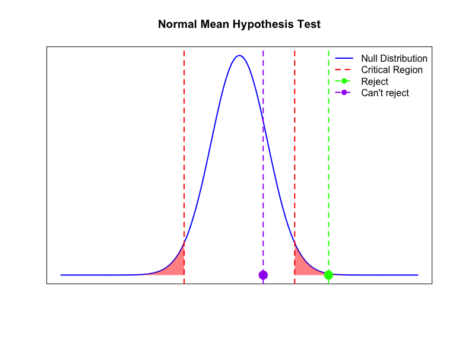

\newcommand{\X}{\mathrm{X}}


## Lecture Outline

* Normal distribution
* Estimation
* Confidence interval
* Hypothesis testing


## Binomial Distribution

* Recall the coin toss example from last class. We tossed a coin $n$ times, where one toss followed a *probability distribution* as:
  \begin{align*}
  \mathbb{P}(X = H) = p \\
  \mathbb{P}(X = T) = 1-p \\
  \end{align*}

* This is an example of Binomial distribution.
* Very important for discrete or non-numeric data.
* To be revisited later, while analyzing count data.


## Plotting the Probability Distribution

* If I assign $p = 0.2$, the plot of probabilities will look like this:


## Normal Distribution

* Today, we will discuss normal distribution -- the most common distribution for continuous data.
* We will discuss estimation, confidence interval, and hypothesis testing.
* We will start with two sample tests.


## Normal Distribution: Definition

* Defined by two parameters: $\mu$ (mean) and $\sigma^2$ (variance).
* Probability density function:
  $$f(x; \mu, \sigma^2) = \frac{1}{\sqrt{2\pi \sigma^2}} \exp{ - \frac{(x - \mu)^2}{2\sigma^2}}$$

  
  
## Properties

* Mean($X$) = Median($X$) = $\mu$.
* var($X$) = $\sigma^2$.
* $X$ is symmetric around the mean.
* Quartiles:
  - $Q_1 \approx \mu − 0.674 * \sigma$
  - $Q_3 \approx \mu + 0.674 * \sigma$
 

## Plotting the Probability Distribution


## Point Estimates

* Recall, we never know parameters. We try to guess them from a sample.
* Suppose we have a sample from a $\mathbb{N}(\mu, \sigma^2)$:
  - $\X = \{x_1, \ldots, x_n\}$.
* We want to estimate the parameters $\mu$ and  $\sigma^2)$:
  - $\hat{\mu} = \bar{x}$ (sample mean).
  - $\hat{\sigma^2} = s^2$ (sample variance).
  

## Confidence Interval (CI)

* Even if we have only $3$ observations, we can estimate both $\mu$ and $\sigma^2$.
* But, are they any good? How confident are we?
* To analyze the reliability of the estimate, we use confidence interval.


## CI (contd.)

* A $100(1 - \alpha)\%$ CI is an interval that is expected to contain the true parameter had we have access to a large number of samples.

* Example: Set $\alpha = 0.05$. A $95\%$ CI for the population mean  ($\mu$) means that, if we had 100 random samples from the population, I expect $95$ of the intervals to contain the true $\mu$.


## CI: Key takeaway

* A wider interval would increase our confidence level $100(1 - \alpha)\%$, but it also introduces more uncertainty on my point estimate.
* We fix the confidence level first, usually at $95\%$ (or $\alpha = 0.05$).
* Given the level, we want a CI as narrow as possible.


## CI for Normal Distribution

* <span style="color:blue;">Case 1: Known variance ($\sigma^2$)</span>.
  - Point estimate of $\mu$: $\bar{x}$.
  - $100(1-\alpha)\%$ of $\mu$ = $\bar{x} \pm z_{\alpha/2} * \frac{\sigma}{\sqrt{n}}$.
    - $\bar{x}$ is the sample mean.
    - $\sigma$ is the standard deviation.
    - $n$ is the number of observations.
    - $z_{\alpha/2}$ is the **z score**, a value derived from the *standard* normal distribution.

## CI for Normal Distribution

* <span style="color:blue;">Case 2: Unknown variance (typical case).</span>
- Point estimate of $\mu$: $\bar{x}$.
- Point estimate of $\sigma^2$: $s^2$.
  - $100(1-\alpha)\%$ of $\mu$ = $\bar{x} \pm t_{\alpha/2, n-1} * \frac{s}{\sqrt{n}}$.
    - $\bar{x}$ and $s^2$ are the sample mean and variance.
    - $n$ is the number of observations.
    - $t_{\alpha/2, n-1}$ is the critical value from a **student's t** distribution with degrees of freedom $n-1$.


## $\texttt{R}$  syntax (Unknown)

``` r
t.test(vector, conf.level = 1- alpha)$conf.int
```

* Example with $\texttt{mtcars}$ data: $95\%$ CI for gas mileage (mpg).


``` r
data("mtcars")
mpgs = mtcars$mpg
t.test(mpgs, conf.level = 0.95)$conf.int
```

```
## [1] 17.91768 22.26357
## attr(,"conf.level")
## [1] 0.95
```


## Example: computation by hand (unknown case)

Example with $\texttt{mtcars}$ data: $95\%$ CI for gas mileage (mpg).


``` r
data("mtcars")
n = nrow(mtcars)
mpgs = mtcars$mpg
xbar = mean(mpgs)
sample_sd = sd(mpgs)
alpha = 0.05
critical_score = qt(1 - alpha/2, df = n - 1)
lower = xbar -critical_score * sample_sd/sqrt(n)
upper = xbar +critical_score * sample_sd/sqrt(n)
c(lower, upper)
```

```
## [1] 17.91768 22.26357
```


## Example: computation by hand (known case)

Example with $\texttt{mtcars}$ data: $95\%$ CI for gas mileage (mpg). Assume $\sigma = 6$.


``` r
sigma = 6
data("mtcars")
n = nrow(mtcars)
mpgs = mtcars$mpg
xbar = mean(mpgs)
alpha = 0.05
zscore = qnorm(1 - alpha)
lower = xbar -zscore * sigma/n
upper = xbar +zscore * sigma/n
c(lower, upper)
```

```
## [1] 19.78221 20.39904
```


## Hypothesis Testing : Motivation

* Recall our coin toss example. 

  - 6 H out of 10 tosses: We should not be able to conclude cheating.
  - 6348 H out of 10000 tosses: We should be able to conclude cheating.
  
* Hypothesis testing helps quantify such decision making.


* A statistical method to draw conclusions or inferences about a population parameter based on sample data and statistics. 

* Recall: Population parameters are unknown; we want to guess them from the samples.


## Hypotheses

* **Hypothesis**: A claim about the unknown population parameter.
  - Example: In the above coin toss example, I suspect that probability of a Head (p) = 0.6
  - Careful: <span style="color:blue;">Hypothesis is about population parameters; never about the sample statistics.</span>

* We typically test two hypotheses: Null hypothesis ($H_0$) and Alternate hypothesis ($H_A$).

## Null vs Alternate

  - **Null hypothesis** ($H_0$): Starting claim or belief about the population parameter.
    - It is true until you have proof that it is false.
  - **Alternate hypothesis** ($H_A$): Another statement about the parameter. It is assumed to be true when we have evidence that $H_0$ is false.
    - We either reject $H_0$ (enough evidence that it's false) or we <span style = "color:limegreen">fail to reject</span> $H_0$. *We never accept $H_0$.*
  


## Graphical representation

<!-- -->


## Two-sided test

- $H_0$: $\mu$ = $m$, $H_A$: $\mu$ $\neq$ $m$.
- Critical region is two sided: $\hat{\mu} \leq c_1$ or $\hat{\mu} \geq c_2$.




##  One-sided test: Case 1

- $H_0$: $\mu$ $\leq$ (or $=$) $m$, $H_A$: $\mu$ $\geq$ $m$.
- Critical region is one sided: $\hat{\mu} \geq c$.


##  One-sided test: Case 2

- $H_0$: $\mu$ $\geq$ (or $=$) $m$, $H_A$: $\mu$ $\leq$ $m$.
- Critical region is one sided: $\hat{\mu} \leq c$.


## Example 1

1. Recall the mallard duck weights example from last class. I want to test if the average weight of mallard ducks is 4kg or not.
  - One or two tailed? 
  - $H_0$: ?
  - $H_A$: ?
  - How would the critical region look like? 
  
## Example 1 (contd.)

1. Recall the mallard duck weights example from last class. I want to test if the average weight of mallard ducks is 4kg or not.
  - One or two tailed? <span style="color:red"> Two tailed</span>
  - $H_0$:  <span style="color:red"> $\mu = 4$.</span>
  - $H_A$:  <span style="color:red"> $\mu \neq 4$ </span>
  - How would the critical region look like? <span style="color:red">$\hat{\mu} \leq c_1$  or $\hat{\mu} \geq c_2$</span>.


## Example 2

2. I believe that the average old car price is Pensacola is **less than** $\$15000.00$.

  - One or two tailed? 
  - $H_0$: ?
  - $H_A$: ?
  - How would the critical region look like? 
  
   
## Example 2

2. I believe that the average old car price is Pensacola is less than $\$15000.00$. How can I do a hypothesis test?

  - One or two tailed? <span style="color:red"> One-tailed.</span>
  - $H_0$: <span style="color:red"> $\mu \geq 15000.00$.</span>
  - $H_A$: <span style="color:red"> $\mu \leq 15000.00$.</span>
  - How would the critical region look like? <span style="color:red">$\hat{\mu} \leq c$</span>.
  

## Testing Errors


Table: Type I and Type II Errors in Hypothesis Testing

|                     |$H_0$ True                                                     |$H_0$ False                                                   |
|:--------------------|:--------------------------------------------------------------|:-------------------------------------------------------------|
|Fail to Reject $H_0$ |<span style='color:green;'>Correct Decision</span>             |<span style='color:red;'>Type I Error (False Positive)</span> |
|Reject $H_0$         |<span style='color:red;'>Type II Error (False Negative)</span> |<span style='color:green;'>Correct Decision</span>            |


## Details of Hypothesis Testing

* Define the **significance level** $\alpha$ = $\mathbb{P}$(Type I error).
* Define $\beta$ = $\mathbb{P}$(Type II error).
* We want to minimize both, but never possible.
* We first fix $\alpha$, typical values are $0.01, 0.05, 0.10$. 
* Then we try to minimize $\beta$, or maximize **Power** = $1 - \beta$.


## Revisit Example 2.

* I believe that the average old car price is Pensacola is less than $\$15000.00$.
* I am testing $H_0$: $\mu \geq 15000.00$, vs $\mu \leq 15000.00$.
  - What is a Type 1 error here?
  - What is a Type 2 error here?
  
## Revisit Example 2.

* I believe that the average old car price is Pensacola is less than $\$15000.00$.
* I am testing $H_0$: $\mu \geq 15000.00$, vs $\mu \leq 15000.00$.
  - What is a Type 1 error here?
    * <span style="color:blue"> When $\mu$, the average old car price, is $\geq 15000.00$, but my hypothesis testing concludes that it is $\leq 15000.00$.
  - What is a Type 2 error here?
    * <span style="color:blue"> When $\mu$, the average old car price, is $\leq 15000.00$, but my hypothesis testing concludes that it is $\leq 15000.00$.


## Test statistic and Critical Region
* <span style="color:blue"> Step 1: State your hypothesis</span>.
* <span style="color:blue"> Step 2: Fix significance level $\alpha$</span>.
* Step 3: Compute the following two numbers:
  * Construct a statistic from the sample, known as **Test Statistic**. 
  * **Critical region** is the range of values of the test statistic that will lead to the rejection of the null hypothesis.


## Final step

* If statistic lies in the critical region, reject $H_0$.
* Otherwise, <span style="color:red"> not enough evidence to reject $H_0$.</span>


## p-value


- **Definition:** The p-value is the probability of obtaining test results at least as extreme as the observed data, assuming the null hypothesis ($H_0$) is true.
- It quantifies the strength of the evidence against $H_0$.
- **p-value $\leq \alpha$**: Reject $H_0$ (Evidence suggests against null)
- **p-value $\geq \alpha$**: Fail to reject $H_0$


## p-value for two-sided test

$H_0$: $\mu$ = $m$, $H_A$: $\mu$ $\neq$ $m$.


## p-value for one-sided test

$H_0$: $\mu$ = $m$, $H_A$: $\mu$ $\geq$ $m$.


## p-value for one-sided test

$H_0$: $\mu$ = $m$, $H_A$: $\mu$ $\leq$ $m$.


## $\texttt{R} syntax


``` r
t.test(<vector>, alternative = <alternative>, 
       mu = <your_null_assumption>, conf.level = <1 - alpha>)
```

* For two-sided test, \<alternative\> = "two.sided".
* For one-sided test, \<alternative\> = "less" or "greater", depending on your test.


## Hypothesis Testing: $\texttt{mtcars}$ data

* Let's test that the average mpg is 18.
* $H_0$: $\mu = 18$ vs $\mu \neq 18$.
* Use $\alpha = 0.05$.
* Here \<alternate\> = "two.sided" in the $\texttt{R}$ code.

## Example (contd.)


``` r
data("mtcars")
MPG = mtcars$mpg
t.test(MPG, alternative = "two.sided",
       mu = 18, conf.level = 0.95)
```

```
## 
## 	One Sample t-test
## 
## data:  MPG
## t = 1.9622, df = 31, p-value = 0.05876
## alternative hypothesis: true mean is not equal to 18
## 95 percent confidence interval:
##  17.91768 22.26357
## sample estimates:
## mean of x 
##  20.09062
```


## Hypothesis Testing: $\texttt{mtcars}$ data

* Let's test that the average mpg is less than 18.
* $H_0$: ??
* Use ??
* Here \<alternate\> = ?? in the $\texttt{R}$ code.

## Example (contd.)


``` r
data("mtcars")
MPG = mtcars$mpg
t.test(MPG, alternative = "two.sided",
       mu = 18, conf.level = 0.95)
```


## Key Takeaway

* Null hypothesis is assumed true until otherwise proved.
* Fix $\alpha$ =  $\mathbb{P}$(Type 1 error) = $\mathbb{P}$(Reject $H_0$ when it is true).
* Minimize $\beta$ = $\mathbb{P}$(Type 2 error) = $\mathbb{P}$(Not reject $H_0$ when it is not true).
* If p-value < $\alpha$, we have evidence to reject $H_0$. 
* Otherwise, <span style="color:blue;"> not enough evidence to reject $H_0$. </span>


