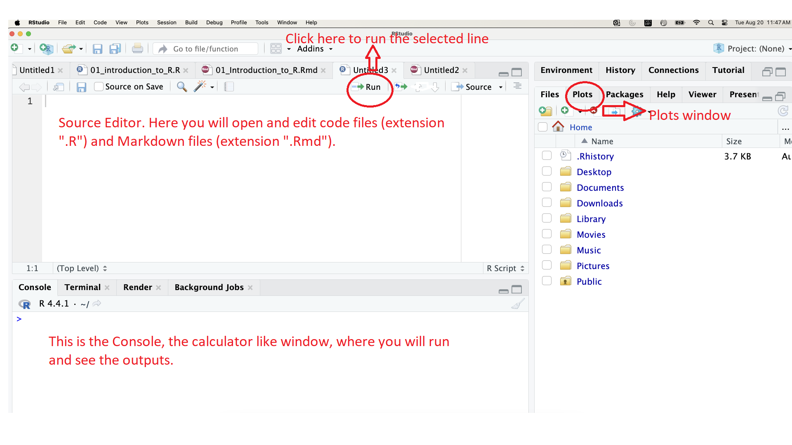

```{r setup, include=F}
knitr::opts_chunk$set(error = TRUE)
```


## Welcome

  - This note is for basic introduction to $\texttt{R}$ and $\texttt{RStudio}$.
  - Please download the **code file** is the **01_introduction_to_R.R** file in *Canvas* module.
  - Once you have access to $\texttt{RStudio}$ (instructions next slide), open the 01_introduction_to_R.R file with it. Run each line to practice and familiarize.
  
## Download instructions

You can either download $\texttt{R}$ and $\texttt{RStudio}$ in your local machine or access it from the college server.

  - If you want to download:
    - Download $\texttt{R}$ at https://cran.rstudio.com.
    - Download $\texttt{RStudio}$ at https://posit.co/download/rstudio-desktop/.
  
  - Alternatively, to access the college server:
    - Go to $\texttt{RStudio}$ at <https://rstudio.hmcse.uwf.edu/>. 
    - Click on **New session** to launch $\texttt{RStudio}$.


## Panes




## $\texttt{R}$ Console (Usually bottom left part): 

  - Here we do mathematical and statistical calculations.
  - Write any code here; then press enter to see the output.
  - Refer to the code files. Run the following lines in Console window of $\texttt{RStudio}$ to practice calculation.
  
```{r}
2 + 5  # Addition
60 - 20 # Subtraction
```
  
## Examples (contd.)
```{r} 
5 * 4 # Multiplication
10/5  # Division
log(24) #Log
```


## Examples (contd.)

```{r}
5^2 #Square
sqrt(100) #Square root
```
  


## Source Editor (Usually top left): 
  
  - This is like any text editor, such as Notepad, Word, Textedit, etc.
  - Here we write and edit our code and save in a file.
  - To run any line, take your cursor to anywhere in the line. Then click **Run** from the Editor Toolbar. Alternatively,  **Ctrl+Enter** (Windows)/**Cmd+Enter**(Mac).
  

## Other Panes on the right

  - Right side has a few panes.
  - Important for now: 
    - Plots (Usually bottom right)
    - Environment (Usuallly  top right)
    


## Define a numeric variable

 - **Syntax: \<\<Variable name\>\> = \<\<Variable value\>\>**
 - Variable name can not start with numerics or special character.
 - Refer to code file. Practice the following in $\texttt{R}$:


```{r}
x = 20 # Define a variable
x + 5 # Use it in future calculation 
x * 4 
```


## Define a character variable

  - Same syntax, but you must use ""
  - Examples: (practice)
```{r}
y = "Ranadeep"
y + 1 # Will throw an error
z = "10"
z/5 # Another error
```
  


## Define a vector 

  - Vector is like an array of numbers or characters.
  - **Syntax: \<\<Vector name\>\> = \<\< c(..., ..., ...)\>\>**.
  - Examples: (please practice)

```{r}
w = c(10, 20, 50, 5.32)
w[3] # Second element
w[10] # 10-th element. It will show NA, a special keyword in R.
```

## Vector(Contd.)

```{r}
length(w) # Length of the vector
max(w) # Maximum
min(w) # Minimum
```
## Character vectors

  - Same syntax, but must use "..." to define character elements.
  - Examples:
      
```{r}
y = c("Ranadeep", "Biostatistics", "STA4173", "UWF", "4173" )
y[2] #Shows second element of vector
y[10] # Doesn't give any error, but shows NA
```


## Careful: No mixed type of vector
- You can not use a vector to contain both number and character.
- $\texttt{R}$ will automatically convert everything to character.
- Try the following and check the output:
```{r}
z = c( 100, "Ranadeep", 35, 40, 45)
z
z[1] + 10 # Will give you an error
```


## Commenting

  - Commenting means adding notes to your code. 
  - $\texttt{R}$ will not process these lines.
  - Any line starting with **\#** is a comment.
  - Examples:
```{r}
# 5 + 10 \# See that there is no output 
# x = 20
# "abcd" + 10
```


## Plot

- Plots will be visible in the bottom right pane.


```{r out.width="50%", out.height= "50%"}
x = c(25, 26, 29, 30, 31,45, 22, 30)
plot(x)
```

## Plot (contd.)

- We will learn this later. It's called **scatterplot**. I am plotting one variable against another.

```{r out.width="50%", out.height= "50%"}
y = c(35, 40, 62, 65, 65, 72, 21, 60)
plot(x, y) 
```


## Packages


- Many contributors have written/ are writing packages that include functionalities.
- The basic $\texttt{R}$ does not come with ALL packages.
- To use them, we will need to install them (only once) and then load (everytime you use it).

## Example 1: $\texttt{R}$ package

- Let's try installing the $\texttt{car}$ package.

```{r}
# install.packages("car")    # Installs the package. 
# Remove the first "#" from above to run the line
library("car")   #loads the package.
```


## Example 2: What does the cow say?
- Let's (install and) load the $\texttt{cowsay}$ package. 
```{r}
# install.packages("cowsay")    # Install it once
library("cowsay")
say("Welcome to STA4173 - Biostatistics", by = "cow")
``` 


## Your task

Can you install and load the $\texttt{tidyverse}$ package?


##   Data and data.frame

- In $\texttt{R}$, we will analyze and model any data.
- Typically, whenever you load any data, it will be of class $\texttt{data.frame}$.
- Rows of data are different observations, columns are different variables.
- Let's try the $\texttt{mtcars}$ data that automatically comes with basic $\texttt{R}$.

## Example
```{r}
data("mtcars") #loads the data for further use
# ?mtcars # Use "?..." to see Help about any package/ function
head(mtcars) # head(...) to see only first 6 rows
```

## $\texttt{mtcars}$ (Contd.)
#### Q1: How many observations or data points (or how many cars do we have here)?

**Ans:** Count the number of rows.
```{r}
nrow(mtcars)
```

#### Q2: How many variables?
**Ans:** Count the number of columns.
```{r}
ncol(mtcars)
```

## $\texttt{mtcars}$ (Contd.)
#### Q3: What are the variables (or column names)?
```{r}
colnames(mtcars)
```

## $\texttt{mtcars}$ (Contd.)
#### Q4: How can I see only the values of the "mpg" variable/colum?
```{r}
mtcars$mpg
```

## $\texttt{mtcars}$ (Contd.)
#### Q4a: How can I see only the "disp" variable/column?
```{r}
#Try it yourself
# Hint: Syntax is <<dataframe name>>$<<column name>>
```

## $\texttt{mtcars}$ (Contd.)
#### Q5: How can I see the maximum and minimum "mpg" of the cars?
```{r}
max(mtcars$mpg)
min(mtcars$mpg)
```

## $\texttt{mtcars}$ (Contd.)

#### Q6: How can I plot the "mpg" column against "disp" column?
```{r out.width="50%", out.height="50%"}
plot(mtcars$disp, mtcars$mpg, xlab = "Disp", ylab = "mpg")
```
